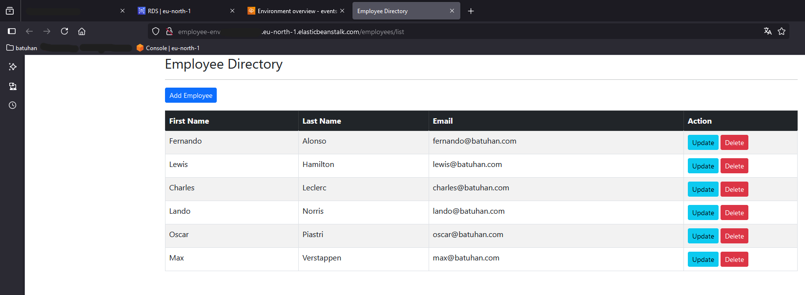

# Deploy Java Spring Boot Apps to Amazon Cloud (AWS)

### Full Stack Cloud Deployment with AWS, Java, Spring Boot, MySQL  

---

- Bu proje, **Java Spring Boot** ile geliştirilen bir **CRUD** uygulamasının **Amazon Web Services (AWS)** platformunda canlıya alınmasını içermektedir. Proje kapsamında AWS’nin farklı servisleri kullanılmış, veritabanı olarak **MySQL** tercih edilmiştir.  

- AWS üzerinde bulut altyapısının kurulumu gerçekleştirilmiş, uygulama **Elastic Beanstalk** kullanılarak dağıtılmıştır. MySQL veritabanı AWS **RDS** üzerinde yapılandırılmıştır. Parametre yönetimi için **AWS Parameter Store**, kullanıcı dostu bir domain için ise **Route 53** kullanılmıştır.  

---

## 1. Proje Hakkında (Overview)  

- **Kullanılan Teknolojiler**:  
   - Backend: Java 17, Spring Boot  
   - Database: MySQL (Workbench ile oluşturuldu)  
   - Cloud Services: AWS Elastic Beanstalk, AWS RDS, AWS Route 53  

- **Kullanılan Araçlar**:  
   - IDE: IntelliJ IDEA  
   - Maven Lifecycle: Clean, Package (Jar dosyası oluşturuldu)  
   - Database Management: MySQL Workbench  

- **AWS Servisleri**:  
   - **Elastic Beanstalk**: Uygulama sunucusu olarak kullanıldı.  
   - **RDS (Relational Database Service)**: Veritabanı oluşturuldu ve yönetildi.  
   - **Parameter Store**: Veritabanı bağlantı bilgileri için güvenli bir ortam sağlandı.  
   - **Route 53**: Özel domain adı oluşturularak kullanıcı deneyimi geliştirildi.  

---

## 2. Teknik Bilgiler (Technical Details)  

- **Backend**  

   - **Mimari**: RESTful API ile CRUD işlemleri.  
   - IntelliJ IDEA üzerinde **Maven Lifecycle** kullanılarak aşağıdaki komutlar çalıştırıldı:  
     - **Clean**: Derleme öncesi geçici dosyalar temizlendi.  
     - **Package**: `target` klasöründe çalıştırılabilir `.jar` dosyası oluşturuldu.  

   - **Çalışma Portu**:  
     - **SERVER_PORT**: `5000`  

   - **Profil Ayarı**:  
     - **SPRING_PROFILES_ACTIVE**: `prod`  

   - **JDBC Properties**:  
     ```properties  
     spring.datasource.url=jdbc:mysql://<db-endpoint>:3306/<database-name>
     spring.datasource.username=<username>
     spring.datasource.password=<password>
     ```  

- **AWS Servis Konfigürasyonu**  

   - **Elastic Beanstalk**:  
     - **Environment Properties** ayarlandı:  
       - **SPRING_DATASOURCE_URL**  
       - **SPRING_DATASOURCE_USERNAME**  
       - **SPRING_DATASOURCE_PASSWORD**  

   - **Parameter Store**:  
     - Veritabanı bağlantı bilgileri (URL, kullanıcı adı, şifre) oluşturuldu.  

- **MySQL Workbench**:  
   - Yerel olarak veritabanı oluşturuldu ve yapılandırıldı.  

---

## 3. Kullanım (Usage)  

- **Backend**  
   - Maven Lifecycle kullanarak aşağıdaki komutlar çalıştırılır:  
     ```  
     mvn clean  
     mvn package  
     ```  
   - `target` klasöründe oluşan `.jar` dosyası AWS Elastic Beanstalk platformuna deploy edilir.  

- **AWS**  
   - **RDS** üzerinde veritabanı oluşturuldu:  
     - Kullanıcı adı: `<Your username>`  
     - Şifre: `<Your password>`  
   - **Elastic Beanstalk** kullanılarak uygulama canlıya alındı.  

---

## 4. Öne Çıkan Özellikler (Key Features)  

- Spring Boot 3 ile RESTful API geliştirme.  
- MySQL veritabanı AWS RDS üzerinde barındırıldı.  
- Elastic Beanstalk ile kolay ve ölçeklenebilir dağıtım.  
- Parametre güvenliği için AWS Parameter Store kullanımı.  
- Özel domain yönetimi için AWS Route 53 entegrasyonu.  

---

## 5. Demo ve Ekran Görüntüleri (Demo & Screenshots)



---

## 6. Katkıda Bulunanlar ve Kaynaklar (Contributors & Resources)  

- **Proje Sahibi**: [Batuhan Baysal](https://www.linkedin.com/in/batuhan-baysal-502656170/)  

- **Kaynaklar**:  
   - Spring Boot Resmi Dokümantasyonu  
   - AWS Resmi Dokümantasyonu  
   - MySQL Workbench Kılavuzu  

---

## 7. İletişim ve Destek (Contact & Support)  

- **LinkedIn**: [Batuhan Baysal LinkedIn Profilim](https://www.linkedin.com/in/batuhan-baysal-502656170/) 
 
- **Github**: [Batuhan Baysal GitHub Profilim](https://github.com/BatuhanBaysal)  
